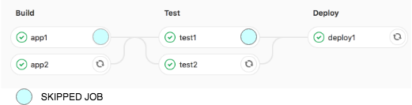

# monorepo.gitlab
> This is an improvement of https://github.com/awesome-inc/monorepo.gitlab
> **NOTE:** only enhanced .sh files , no Windows support yet, feel free to fork and improve them.


Scripts helping towards [Monorepo](https://medium.com/@maoberlehner/monorepos-in-the-wild-33c6eb246cb9) with [GitLab CI](https://docs.gitlab.com/ee/ci/yaml/).

Mostly adapted from workarounds given in [gitlab-ce/issues/19232](https://gitlab.com/gitlab-org/gitlab-ce/issues/19232).
Hopefully soon to be integrated into GitLab CI!

## How to use

Add as a submodule

```bash
git submodule add https://github.com/mobicorp-inc/monorepo.gitlab.git .monorepo.gitlab
```

and update your `.gitlab-ci.yml`.

- Add some `variables` and a `before_script` to get the *last green commit* in Gitlab CI

```yml
# needs `curl`, `jq` 1.5 and `${PRIVATE_TOKEN}, cf.:
# - https://docs.gitlab.com/ee/api/#personal-access-tokens
# - https://docs.gitlab.com/ce/ci/variables/README.html#secret-variables
variables:
  GIT_SUBMODULE_STRATEGY: recursive
  CI_SERVER_URL: https://gitlab.com
before_script:
    - .monorepo.gitlab/last_green_commit.sh
```

- Build your sub-component `foo` only when there are diffs in `./foo`, `./libs` or `anyother_regex` since the *last green commit*

```yml
build-foo:
  # before
  script: build foo
  # after
  script: |
    # command at the end is optional, one can use noop ":"
    .monorepo.gitlab/build_if_changed.sh "Dockerfile|libs|apps/foo|foo"
    if [ ! -f .SKIP_THIS_JOB ]; then
      bash build.sh foo
      echo "more commands here"
    fi
```

- Skip subsequent jobs that depend on previous skipped jobs by:

> an image is worth a thousand words


```yml
test-foo:
  stage: test
  script: |
    if [ ! -f .SKIP_THIS_JOB ]; then
      ls -a
      echo "Do a test here"
      echo "For example run a test suite"
    fi
  dependencies:
  - build-foo
```


## Motivation

* You actually want to build not only when the 'foo' changes but also when: libs/, Dockerfile, etc. So I implemented regex matching.
* actually there's no way of skipping a gitlabci job, so if you exit with non-zero the whole pipeline will fail, if you use api/jobs to cancel the job the whole pipeline gets canceled, So I figure it out it will be a good idea to use simple ifs.
* skip also subsequent jobs.

## Tips

Use [YAML anchors](http://blog.daemonl.com/2016/02/yaml.html#yaml-anchors-references-extend) to keep your jobs DRY.

Then, your jobs in `.gitlab-ci.yml` could look something like this

```yml
# Use yml anchors, to keep jobs DRY, cf.: https://docs.gitlab.com/ee/ci/yaml/#anchors
.build_template: &build_definition
  tags:
    - linux
    - docker
  stage: build
  script: |
    .monorepo.gitlab/build_if_changed.sh "Dockerfile|libs|apps/${CI_JOB_NAME}"  ":"
    if [ ! -f .SKIP_THIS_JOB ]; then
      bash build.sh ${CI_JOB_NAME}
      echo hello
    fi
  artifacts:
    paths:
    - ".SKIP_THIS_JOB"

webapp:
  <<: *build_definition

```